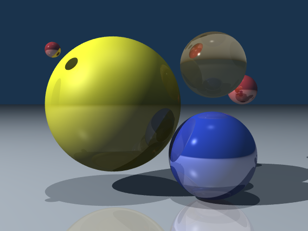
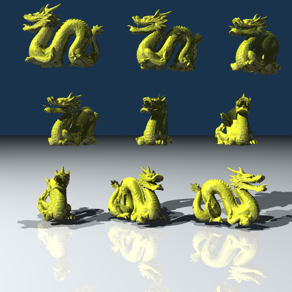
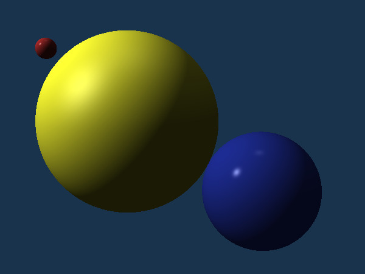
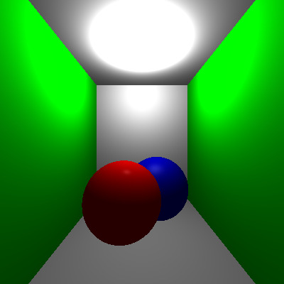
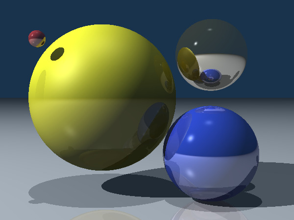
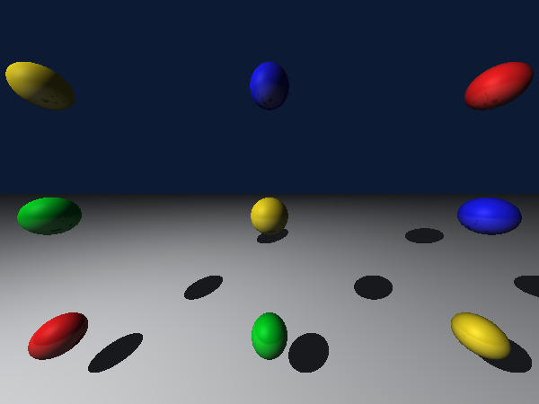
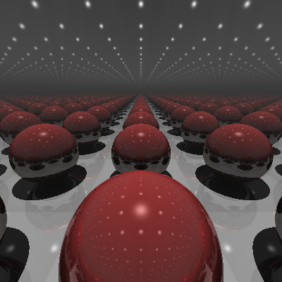
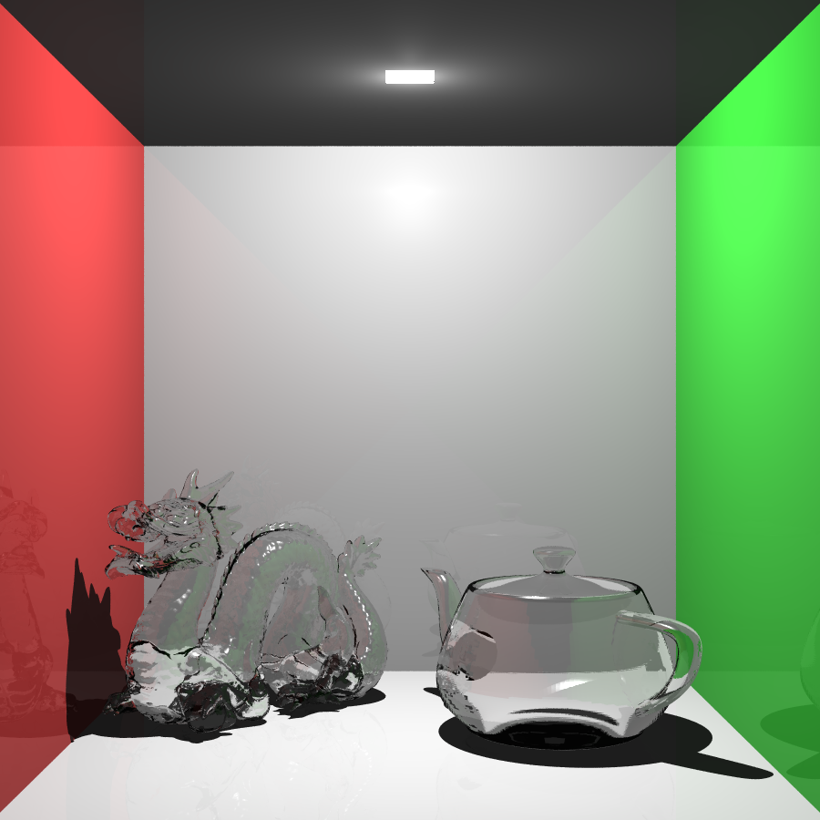
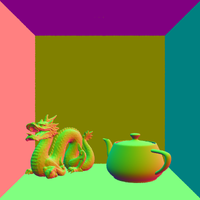
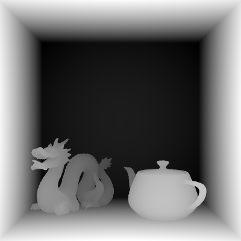

# Raytracer

## Author
František Srb

-----
[//]: <> (You should make a copy of the rest of this template for)
[//]: <> (each checkpoint. You can remove irrelevant parts for the)
[//]: <> (clarity of the document.)

## Images





## Command line arguments

Note: Old options are hidden behind dropdown menu. They still work but, are not important for current checkpoint.

Note2: You can input Vectors3 in command line by seperating them using quotes: `"1 2.3 4"`

root options:
* **-c, --config** path to the configuration file
    * example use: `.\bin\Debug\net7.0\rt004.exe -c .\configs\example-config.txt`

command: **render**

* Renders a HDR image of a scene

* arguments (in this order):
    | Type | Name |  Description |
    |-------|-----|-----------------------|
    | string | **output path** | name and path of the output image

* options
    | Type | Name | option | Description |
    |-------|-----|----|-----------------------|
    | string (multiple) | **scene file(s)** | -s | path to the scene file(s) in ascending order of priority |

* scenes([Scenes Directory](/rt004/scenes/))
    * `sample.json` - renders a sample scene from the task
        * `sample_cameraSide.json` - overrides camera so that we cann see the scene from right side
        * `sample_shadowPlay.json` - overrides lights to create single red light
    * `scene_test.json` - single sphere,plane and light
    * `cornell_box.json` - 2nd image on the page (glass dragon and teapot) 
    * `9rotations.json` - draws image with 9 rotated objects (a override is recommended:)
        * `overrides/dragon8k.json` - dragon with 8k faces
        * `overrides/dragon87k.json` - dragon with 87k faces
        * `overrides/dragon871k.json` - dragon with 871k faces
        * `overrides/teapot.json` - teapot object

* example use:
    * `.\bin\Release\net7.0\rt004.exe render "out_sample.pfm" -s ".\scenes\sample.json"`
    * `.\bin\Release\net7.0\rt004.exe render "out_sampleShadowSide.pfm" -s ".\scenes\sample.json" ".\scenes\overrides\sample_shadowPlay.json" ".\scenes\overrides\sample_cameraSide.json"`
    

<details>
<summary> command: <b>example</b> </summary>

<br>

* arguments (in this order):
    | Type | Name | Default Value| Description |
    |-------|-----|-----|-----------------------|
    | int | **width** | 800 | width of the output image in pixels |
    | int | **height** | 600 | height of the output image in pixels |
    | string | **fileName** | default.pfm | name/path of the output image
    | float | **frequency** | 3.33 |  frequency of the hue change
* example use: `.\bin\Debug\net7.0\rt004.exe example 400 400 example.pfm 10.8`
</details>

## Configs
List of **interesting** config files in `\configs\` folder and their description:
* `sample-config.txt`
    * renders a sample image from [Step 8](../s08-ch2-RTimage/README.md)
* `sample-...-config.txt`
    * renders the same scene with some differences(camera or light)
* `sample-all.txt`
    * renders 4 pictures of sample scene with different overrides for each picture
    * also shows how batching can be done
* `9dragons.txt`
    * scene with 9 rotated dragons (1st picture in this readme)
* `cornell.txt`
    * similar to 2nd picture in this readme (but smaller dragon to render)
    * (takes around 1s to preprocess and around 20s to render with 20 workers)
* `cornell_complex.txt`
    * the 2nd picture in this readme
    * (takes around 12s to preprocess and 23s to render with 20 workers)


### Input data
[//]: <> (Define the format of the input data if it is relevant to the program.)

The scene definition must be contained in .json file.
The class which is encoded can have the following members:
* `Camera` {}
    * `Width` -- width of the final image in pixels
    * `Height` -- height of the final image in pixels
    * `Position` -- position of the camera in the scene, specified as a string with three space-separated values representing the x, y, and z coordinates
    * `LookAt` -- the point the camera is looking at, specified as a string with three space-separated values representing the x, y, and z coordinates
    * `Fov` -- field of view of the camera in degrees
    * `MaxDepth` -- maximum depth for ray tracing
    * `Spp` -- samples per pixel for anti-aliasing
    * `Mode` -- Sets the program to render specific things
      * `Color` -- Default - classic raytracing
      * `Normal` -- render normals, ignores refraction/reflection
      * `Depth` -- render depths of traced pixels. also ignores refraction/reflection and values are normilzed in post-process

* `BackgroundColor` -- background color of the scene, specified as a string with three space-separated values representing the RGB components

* `Materials` {}
    * `Name` -- identifier
    * `Color` -- color of the material, specified as a string with three space-separated values representing the RGB components
    * `A` -- ambient reflectance component
    * `D` -- diffuse reflectance component
    * `S` -- specular reflectance component
    * `H` -- shininess factor
    * `Alpha` -- transparency component
    * `N` -- refractive index (optional, typically used for materials like glass)

* `Lights` []
    * `Type` -- type of light (`Ambient`, `Point`, `Directional`)
    * `Color` -- color of the light, specified as a string with three space-separated values representing the RGB components
    * `Intensity` -- intensity of the light
    * `Position` -- position of the light in the scene, specified as a string with three space-separated values representing the x, y, and z coordinates (for `Point` lights)

* `Nodes` {}
    * `Name` -- identifier
    * `Solid` -- defines the geometric shape (e.g., `Plane`, `Sphere`)
    * `Material` -- material of the object, which refers to the materials defined in the `Materials` section
    * `Children` [] -- list of child nodes.
    * `Transforms` [] -- list of transformations to apply to the children. Transformations can include:
        * `Translation` -- moves the object by the specified x, y, and z values
        * `Scale` -- scales the object by the specified x, y, and z factors
        * `Rotation` -- rotate the object by euler angles
    * Note: each children is transformed by transform with the same index. Empty transform `{}` means identity.
    * Note: there must be excatly one node named `root`


<details>
<summary> Example json: </summary>

```json
{
  "Camera": {
    "Width": 800,
    "Height": 600,
    "Position": "0 3 -30",
    "LookAt": "0 0 0",
    "Fov": 45,
    "MaxDepth": 8,
    "Spp": 2,
    "Mode": "Color"
  },

  "BackgroundColor": "0.1 0.2 0.4",

  "Nodes": {
    "wall": {
      "Solid": "Plane"
    },
    "sphere": {
      "Solid": "Sphere"
    },
    "redSphere": {
      "Material": "red",
      "Children": [ "sphere" ],
      "Transforms": [
        {}
      ]
    },
    "root": {
      "Material": "white",
      "Children": [ "wall", "redSphere" ],
      "Transforms": [
        {
          "Translation": "0 0 5",
          "Rotation": "-90 0 0"
        },
        {
          "Translation": "0 0 1",
          "Scale": "2 2 2"
        }
      ]
    }
  },

  "Materials": {
    "white": {
      "Color": "0.8 0.8 0.8",
      "A": 0.2,
      "D": 0.6,
      "S": 0.4,
      "H": 400
    },
    "red": {
      "Color": "1 0 0",
      "A": 0.2,
      "D": 0.2,
      "S": 0.8,
      "H": 100
    }
  },

  "Lights": [
    {
      "Type": "Ambient",
      "Color": "1 1 1",
      "Intensity": 1
    },
    {
      "Type": "Point",
      "Position": "0 2 -1",
      "Color": "1.0 1.0 1.0",
      "Intensity": 1.0
    }
  ]
}

```

</details>

## Old Checkpoints

<details>

<summary>
Checkpoint 1
</summary>

<br>

## Checkpoint 1 (tag `Chk1`)

I have setup the parser (FrontController style) and config files (just plain .txt files containing the command line arguments).
Example image is divided into 4 corners, where each corner uses different distance metric (2x manhattan).

### Use of AI
I asked ChatGPT in this [convo](https://chat.openai.com/share/a940aad7-2275-4108-a56b-930e43e44ada) to give me a HSV to RGB conversion algorithm, which I then used only as a base and heavily modified it (for example setting both saturation and value to 1).


### Algorithm
I don't know if its just a version, but the OpenTK's HSVtoRGB doesnt make sense?
(it uses Hue to only select the 1/6 *slice*, but not exact hue in that *slice*)


`new Color3<Hsv>().ToRgb();`

</details>

<br>

<details>

<summary> Checkpoint 2 </summary>

## Checkpoint 2 (tag `Chk 2`)

I have completed all 5 tasks. I used OOP and I am currently having scenes *baked in* the code, but they should be able to be read from files in near future.
This is how i tackled them and where to find them:

### Camera 

Implemented in [Camera.cs](rt004/Rendering/Camera.cs).
Defined by width and height of [Canvas](rt004/Utility/Canvas.cs), 3 vectors (position of camera, point to look at, world up) and fov (horizontal angle in degrees).
It calculates necessary vectors in constructor and can create a [Ray](rt004/Rendering/Ray.cs) (struct) which is defined parametrically `P0 + t * p1`.

### Solids

Each Solid inherits from [ISolid](rt004/Solids/ISolid.cs) and contains reference to material, has its transform and has `Intersect` method.

I have implemented [Sphere](rt004/Solids/SolidSphere.cs) and [Plane](rt004/Solids/Plane.cs).

### BRDF

I already allow multiple lights and all is referenced and taken into account in [Scene](rt004/Rendering/Scene.cs) class. The phong BRDF is inside the `RenderScene(camera)` method. [Materials](rt004/Rendering/Material.cs) are seperate classes containing color and coefficients.

### Light

[Light.cs](rt004/Rendering/Light.cs) contains all 3 types of lights (ambient/directional/point).

### Image Synthesizer

[Scene](rt004/Rendering/Scene.cs) is the main class, where all important information is stored and also the main rendering loop takes place. Here we can see two prepared scenes:

Sample Scene:




Room Scene:




</details>

<br>

<details>

<summary> Checkpoint 3 </summary>

## Checkpoint 3 (tag `Chk3`)

Results of this checkpoint:



(i had to change the dir vector to (0, -0.05, 1))



<br>

(only 6 solids: 4 mirrors plane, 1 floor plane, 1 sphere)
We can see many mistakes:
* The shadows should look differently, reflected lights from mirrors should also throw shadows
* Only the middle light gives specular highlight.. but what about all the others in reflections



### OOP

The program was using oop from start. The only thing I am not sure about is where to store/reference the (Phongs) BRDF. 
As of now, I am referncing it in material, as I am looking at it as a kind of shader the material would use in fragment shading.

### Shadows

For now it is implemented in [Light.cs](/rt004/Rendering/Light.cs) but needs a refernce to scene.
I am looking if any solid intersect the ray light->(shaded point). I am using LINQ for simplicity,
but if I ever need to make this faster -> just dont use LINQ.

### Raytracing

Raytracing is done in [Scene.cs](/rt004/Rendering/Scene.cs) in `Shade()` method.
It is currently only stopping if depth reaches 0 **or** it hits nothing (background).  


### Work to be done

* I really should clean the codebase and unify naming of things.
* ~~I needed the light to have 100x the intensity than mentioned in the sample scene.~~
* Have scene be described in hierarchy file.
* Phong BRDF is baked in the scene rendering. Think of better way to set it:
    * Material can refernce what brdf it is using? (sounds like shaders)
    * Maybe one brdf per scene/camera, which can be set from outside
* Many TODOs in code (some of them are future tasks)
* ~~Have all vectors stored normalized -> no need to normalize them when calculating~~


## Command line arguments

Note: Old options are hidden behind dropdown menu. They still work but, are not important for current checkpoint.

Note2: You can input Vectors3 in command line by seperating them using quotes: `"1 2.3 4"`

root options:
* **-c, --config** path to the configuration file
    * example use: `.\bin\Debug\net7.0\rt004.exe -c .\configs\example-config.txt`

command: **render**

* Renders a HDR image of a scene

* arguments (in this order):
    | Type | Name | Default Value| Description |
    |-------|-----|-----|-----------------------|
    | int | **width** | 800 | width of the output image in pixels |
    | int | **height** | 600 | height of the output image in pixels |
    | string | **fileName** | default.pfm | name/path of the output image

* options
    | Type | Name | option | Default Value| Description |
    |-------|-----|----|-----|-----------------------|
    | float | **Field Of View** | --fov | 90 | horizontal angle of camera view in degrees |
    | vector3 | **[K]camera Position** | -kp | "0 0 -1" | position of camera in world space |
    | vector3 | **[K]camera Look at** | -kl | "0 0 0" | point in the world at which the camera will look at |
    | vector3 | **[K]camera Up** | -ku | "0 1 0" | world up vector, to rotate camera by z/lookAt axis |
    | string | **Scene** | -s | room | name of the scene to render (see next list item) |
    | int | **Raytrace max Depth** | -rd | -1 | Sets the maximum depth of raytracer (-1 for scene default value) |

* scenes
    * `room` - renders a room with 5 walls and 2 spheres
    * `sample` - renders a sample scene from the task
    * `trace` - similar to sample but with extra golden sphere (and plane)
    * `mirror` - renders a scene with 4 mirrors forming a box and sphere inside
    * `frustum` - in this scene you can see clearly the effects of perspective projection
    * `debug` - displays each pixel as ray direction vector (debugging purposes)

* example use:
    * `.\bin\Debug\net7.0\rt004.exe render 500 500 test.pfm -s room -kp "0 2.5 -2" -kl "0 2.5 0" --fov 90`
    * `.\bin\Debug\net7.0\rt004.exe -c .\configs\room-config.txt -ku "1 0 0"`
    

<details>
<summary> command: <b>example</b> </summary>

<br>

* arguments (in this order):
    | Type | Name | Default Value| Description |
    |-------|-----|-----|-----------------------|
    | int | **width** | 800 | width of the output image in pixels |
    | int | **height** | 600 | height of the output image in pixels |
    | string | **fileName** | default.pfm | name/path of the output image
    | float | **frequency** | 3.33 |  frequency of the hue change
* example use: `.\bin\Debug\net7.0\rt004.exe example 400 400 example.pfm 10.8`
</details>

## Configs
List of config files in `\configs\` folder and their description:
* `example-config.txt`
    * creates HDR image for first checkpoint
    * rainbow based on distance from center using different metrics
* `room-config.txt`
    * renders a room-like scene which will be used to show progress in future task
* `sample-config.txt`
    * renders a sample image from [Step 8](../s08-ch2-RTimage/README.md)
* `trace-config.txt`
    * renders a sample image from [Step 11](../s11-ch3-RayTracing/README.md)
* `mirror-config.txt`
    * renders a mirror room
* `frustum-config.txt`
    * renders a frustum showcasing scene from [Step 11](../s11-ch3-RayTracing/README.md)

### Input data
[//]: <> (Define the format of the input data if it is relevant to the program.)

None

</details>

<br>

<details>

<summary> Checkpoint 4 </summary>

## Checkpoint 4 (tag `Chk4`)

Results of this checkpoint:


### Hierarchy

Hierarchy is done through json files.
Json file will contain 5  fields:
* Camera
* Nodes
* Lights
* Materials
* BackgroundColor

You can combine multiple json files by inputing them as parameters to the executable and they will override the previous ones.

Steps:

1. I parse jsons to create [SceneJson class](/rt004/Utility/SceneJson.cs) and with every new one the old one fields are overriden
2. After that, a [SceneGraph class](/rt004/Utility/SceneGraph.cs) is created, containing all necessary references.
3. A classic `Scene` class is created, with all the solids flattened to a list and having appropriate matrix transformations (with inverses)
4. Render

BIG TODO: override only those which names collide. As of now. describing materials in one file destorys all materials loaded from the previous one.


### Refractions

Refraction is contained in the `Shade()` method of [Scene class](/rt004/Rendering/Scene.cs).

`Refractance` vector is calculated in `Refractance()` method in [Ray.cs](/rt004/Rendering/Ray.cs) file.

### AA

Supersampling by jittering.

`Camera` knows about the supersampling size which is stored in `spp` variable. (`spp = 3` means the pixel is divided into 3x3 micropixels). `Camera` is also creating these micropixels in `GenerateRay()` method.


### Parallelism

The canvas is divided into `n` x `n` blocks (where `n=16` for now) and number of workers are created, that take work from common queue when they have no work assigned or their work is done. The number of workers are equal to logical processor count of the device.

### Other

Config files were updated to allow multiple render commands at once (see [sample-all.txt](/rt004/configs/sample-all.txt)).

### Work to be done

* ~~Have scene be described in hierarchy file.~~
* Phong BRDF is baked in the scene rendering. Think of better way to set it:
    * Material can refernce what brdf it is using? (sounds like shaders)
    * Maybe one brdf per scene/camera, which can be set from outside
* Hierarchy: override only those objects with colliding names
* Flattening solids to a single list doesn't allow AABB and other accelarating optimalizations


## Command line arguments

Note: Old options are hidden behind dropdown menu. They still work but, are not important for current checkpoint.

Note2: You can input Vectors3 in command line by seperating them using quotes: `"1 2.3 4"`

Chk4 Note: Old command arguments are totally reowrked and no longer work. Please use hierarchy files instead.

root options:
* **-c, --config** path to the configuration file
    * example use: `.\bin\Debug\net7.0\rt004.exe -c .\configs\example-config.txt`

command: **render**

* Renders a HDR image of a scene

* arguments (in this order):
    | Type | Name | Default Value| Description |
    |-------|-----|-----|-----------------------|
    | string | **output path** | -- | name and path of the output image

* options
    | Type | Name | option | Default Value| Description |
    |-------|-----|----|-----|-----------------------|
    | string (multiple) | **scene file(s)** | -s | -- | path to the scene file(s) in ascending order of priority |

* scenes([Scenes Directory](/rt004/scenes/))
    * `sample.json` - renders a sample scene from the task
        * `sample_cameraSide.json` - overrides camera so that we cann see the scene from right side
        * `sample_shadowPlay.json` - overrides lights to create single red light
    * `scene_test.json` - single sphere,plane and light

* example use:
    * `.\bin\Release\net7.0\rt004.exe render "out_sample.pfm" -s ".\scenes\sample.json"`
    * `.\bin\Release\net7.0\rt004.exe render "out_sampleShadowSide.pfm" -s ".\scenes\sample.json" ".\scenes\sample_shadowPlay.json" ".\scenes\sample_cameraSide.json"`
    

<details>
<summary> command: <b>example</b> </summary>

<br>

* arguments (in this order):
    | Type | Name | Default Value| Description |
    |-------|-----|-----|-----------------------|
    | int | **width** | 800 | width of the output image in pixels |
    | int | **height** | 600 | height of the output image in pixels |
    | string | **fileName** | default.pfm | name/path of the output image
    | float | **frequency** | 3.33 |  frequency of the hue change
* example use: `.\bin\Debug\net7.0\rt004.exe example 400 400 example.pfm 10.8`
</details>

## Configs
List of **interesting** config files in `\configs\` folder and their description:
* `sample-config.txt`
    * renders a sample image from [Step 8](../s08-ch2-RTimage/README.md)
* `sample-...-config.txt`
    * renders the same scene with some differences(camera or light)
* `sample-all.txt`
    * renders 4 pictures of sample scene with different overrides for each picture
    * also shows how batching can be done

### Input data
[//]: <> (Define the format of the input data if it is relevant to the program.)

The scene definition must be contained in .json file.
The class which is encoded can have the following members:
* `Camera` {}
    * `Width` -- width of the final image in pixels
    * `Height` -- height of the final image in pixels
    * `Position` -- position of the camera in the scene, specified as a string with three space-separated values representing the x, y, and z coordinates
    * `LookAt` -- the point the camera is looking at, specified as a string with three space-separated values representing the x, y, and z coordinates
    * `Fov` -- field of view of the camera in degrees
    * `MaxDepth` -- maximum depth for ray tracing
    * `Spp` -- samples per pixel for anti-aliasing

* `BackgroundColor` -- background color of the scene, specified as a string with three space-separated values representing the RGB components

* `Materials` {}
    * `Name` -- identifier
    * `Color` -- color of the material, specified as a string with three space-separated values representing the RGB components
    * `A` -- ambient reflectance component
    * `D` -- diffuse reflectance component
    * `S` -- specular reflectance component
    * `H` -- shininess factor
    * `Alpha` -- transparency component
    * `N` -- refractive index (optional, typically used for materials like glass)

* `Lights` []
    * `Type` -- type of light (`Ambient`, `Point`, `Directional`)
    * `Color` -- color of the light, specified as a string with three space-separated values representing the RGB components
    * `Intensity` -- intensity of the light
    * `Position` -- position of the light in the scene, specified as a string with three space-separated values representing the x, y, and z coordinates (for `Point` lights)

* `Nodes` {}
    * `Name` -- identifier
    * `Solid` -- defines the geometric shape (e.g., `Plane`, `Sphere`)
    * `Material` -- material of the object, which refers to the materials defined in the `Materials` section
    * `Children` [] -- list of child nodes.
    * `Transforms` [] -- list of transformations to apply to the children. Transformations can include:
        * `Translation` -- moves the object by the specified x, y, and z values
        * `Scale` -- scales the object by the specified x, y, and z factors
        * `Rotation` -- rotate the object by euler angles
    * Note: each children is transformed by transform with the same index. Empty transform `{}` means identity.
    * Note: there must be excatly one node named `root`


<details>
<summary> Example json: </summary>

```json
{
  "Camera": {
    "Width": 800,
    "Height": 600,
    "Position": "0 3 -30",
    "LookAt": "0 0 0",
    "Fov": 45,
    "MaxDepth": 8
  },

  "BackgroundColor": "0.1 0.2 0.4",

  "Nodes": {
    "wall": {
      "Solid": "Plane"
    },
    "sphere": {
      "Solid": "Sphere"
    },
    "redSphere": {
      "Material": "red",
      "Children": [ "sphere" ],
      "Transforms": [
        {}
      ]
    },
    "root": {
      "Material": "white",
      "Children": [ "wall", "redSphere" ],
      "Transforms": [
        {
          "Translation": "0 0 5",
          "Rotation": "-90 0 0"
        },
        {
          "Translation": "0 0 1",
          "Scale": "2 2 2"
        }
      ]
    }
  },

  "Materials": {
    "white": {
      "Color": "0.8 0.8 0.8",
      "A": 0.2,
      "D": 0.6,
      "S": 0.4,
      "H": 400
    },
    "red": {
      "Color": "1 0 0",
      "A": 0.2,
      "D": 0.2,
      "S": 0.8,
      "H": 100
    }
  },

  "Lights": [
    {
      "Type": "Ambient",
      "Color": "1 1 1",
      "Intensity": 1
    },
    {
      "Type": "Point",
      "Position": "0 2 -1",
      "Color": "1.0 1.0 1.0",
      "Intensity": 1.0
    }
  ]
}

```

</details>
</details>
<br>
<details>
<summary> Checkpoint 5 </summary>
## Topics (tag `Top1`)

Results of this checkpoint:

`.\bin\Release\net7.0\rt004.exe -c .\configs\9dragons.txt`


<br>

`.\bin\Release\net7.0\rt004.exe -c .\configs\cornell_complex.txt`



### More-solids (`t01`)

I have created simple imports for .obj file. A mesh is loaded as an array of triangles.
The code can be mainly found in [TriangleMesh.cs](./rt004/Solids/TriangleMesh.cs). It uses BVH which is discussed later in (`t08`).

Important notice: Only vetices and triangle faces are supported as of now.

### Parallelism (`t06`)

The canvas is divided into `n` x `n` blocks (where `n=16` for now) and number of workers are created, that take work from common queue when they have no work assigned or their work is done. The number of workers are equal to logical processor count of the device.

### Acceleration (`t08`)

To help renderer with rendering complex models I implemented BVH with AABB found in [BVH.cs](./rt004/Utility/BVH.cs) and [AABB.cs](./rt004/Solids/AABB.cs).

**AABB** is created quite simply by getting an array of triangles and founding its minmaxes.

On the other hand the **BVH** is more sophisticated:
* Volume is always divided at longest axis
* It is bounded by max tree depth and minimum triangles per list
* SAH is also involved
  * a K candidates are chosen (max 32)
  * for each candidate, calculate the sum of costs of new child lists using the heuristics
  * (this is paralled using `Parallel.For` )
* This is done once per mesh. So multiple instances of meshes doesn't require recalculation
* Introduction of SAH into the BVH (instead of splitting at middle) introduced a heavy preprocess load. But this should be worth in complex scenes with many instances of these objects
* Creating a BVH for 871k faces dragon model takes around 9s and rendering it takes 1.3s

<details>
<summary> The progress of accelaration </summary>

* Spp: 2
* Parallel workers: 20
* Size: 600x450
  * [Dragon 8k model](./rt004/models/dragon_8k.obj) (8713 faces) 

| Stage | Scene preprocessing | 0 bounces | 5 bounces | Description|
|------|---------------------|-------------|---------------|------------|
| Before  | 50ms | 111 145ms | 153 743ms | Before any acc was implemented
| single AABB | 62ms | 32 969ms | 68 807ms | Single AABB around whole model
| BVH (mid-ax rb)| 80ms | 510ms | 894ms | BVH with splitting axis in middle in round-robin fashion|
| BVH (mid longest-ax)| 85ms | 655ms | 1350ms | BVH with splitting the longest axis in middle|
| BVH (SAH)| 183ms | 571ms | 858ms | BVH with SAH heuristics splitting the longest axis |

  * [Dragon 871k model](./rt004/models/dragon_871k.obj) (871 414 faces) 

| Stage | Scene preprocessing | 0 bounces | 5 bounces | Description|
|-------|---------------------|-----------|-----------|------------|
| BVH (mid-ax rb)| 4100ms | 860ms | 2138ms | BVH with splitting axis in middle in round-robin fashion|
| BVH (mid longest-ax)| 3700ms | 730ms | 1737ms | BVH with splitting the longest axis in middle|
| BVH (SAH)| 10100ms | 798ms | 1274ms | BVH with SAH heuristics splitting the longest axis |


</details>

### Extras:

#### Normal/Depth rendering

You can set option in camera (see [Input data](#input-data)) to render normals or depth onto the final image. This rendering doesnt take into account maxDepth, as rays in this mode doesn't reflect. 

Examples:

 


### Work to be done

* Phong BRDF is baked in the scene rendering. Think of better way to set it:
    * Material can refernce what brdf it is using? (sounds like shaders)
    * Maybe one brdf per scene/camera, which can be set from outside
* ~~Hierarchy: override only those objects with colliding names~~
* Do a BVH for whole scene
    * Currently it is only calculated for imported .obj

</details>
